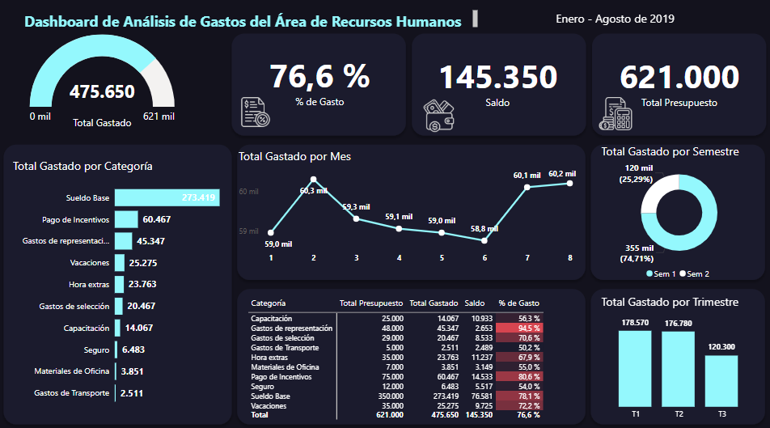

# Mi primer informe en Power BI

## Explicación 

El reporte nos muestra el análisis de gastos del área de RH, podemos ver el gráfico de velocímetro, porcentaje de gasto, presupuesto total y diferentes gráficos. 

